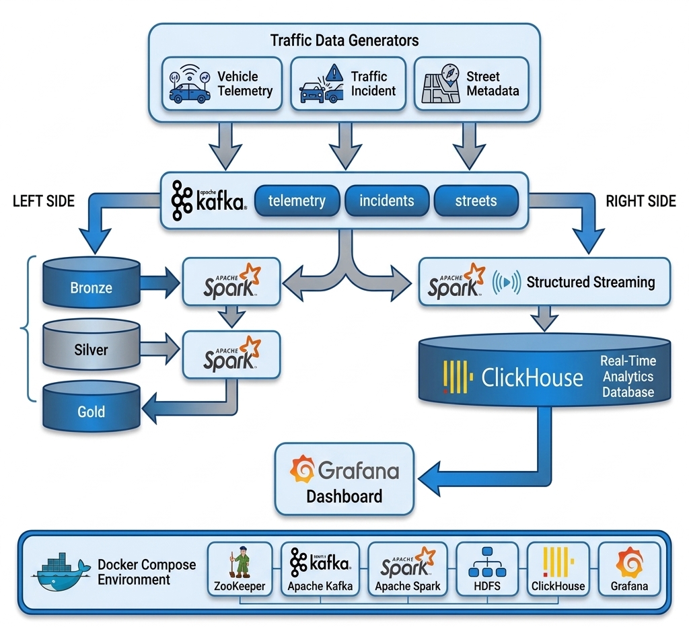
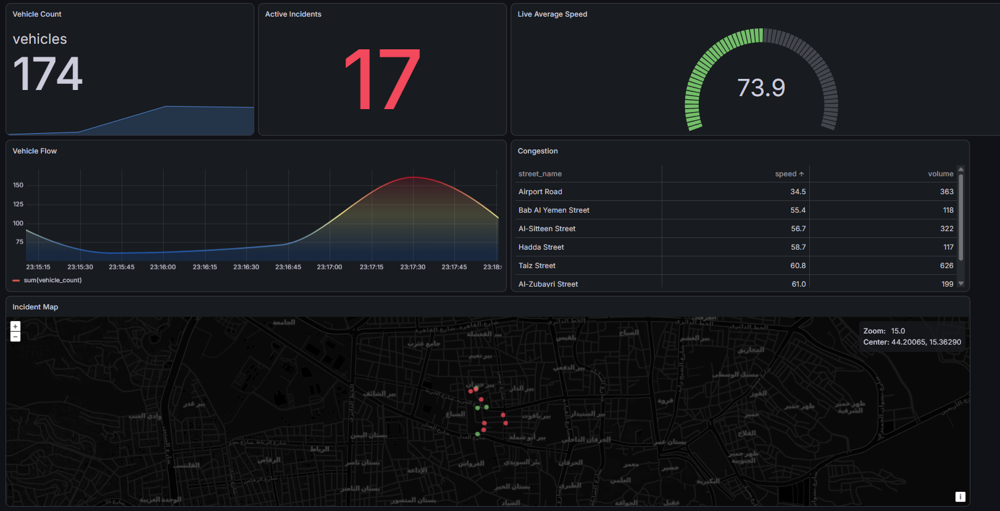

# 🚦 Smart City Traffic Analytics Platform

A real-time and batch data engineering platform for Smart City traffic analytics using **Apache Kafka**, **Apache Spark**, **HDFS**, **ClickHouse**, **Docker**, and **Grafana**.

The project demonstrates a complete modern data pipeline implementing the **Medallion Architecture (Bronze → Silver → Gold)** together with a real-time streaming pipeline for live traffic monitoring and visualization.

---

# 📌 Project Overview

This project simulates traffic data generated from multiple smart city sources such as:

* Vehicle telemetry
* Traffic incidents
* Street reference data

The data is ingested into Kafka, processed using Apache Spark, stored in HDFS following the Medallion architecture, and streamed into ClickHouse for real-time analytics. Grafana is used for dashboard visualization.

---

# 🏗️ Architecture

```
                Data Generators
                      │
                      ▼
                Apache Kafka
                      │
        ┌─────────────┴─────────────┐
        │                           │
        ▼                           ▼
 Historical Pipeline          Streaming Pipeline
        │                           │
        ▼                           ▼
 Bronze Layer                Spark Structured Streaming
        │                           │
        ▼                           ▼
 Silver Layer                 ClickHouse
        │                           │
        ▼                           ▼
 Gold Layer                  Grafana Dashboards
        │
        ▼
      HDFS
```

---

# 🛠️ Technology Stack

| Technology                 | Purpose                      |
| -------------------------- | ---------------------------- |
| Apache Kafka               | Data ingestion               |
| Apache Spark 3.5           | Batch & Streaming processing |
| Spark Structured Streaming | Real-time processing         |
| HDFS                       | Data Lake storage            |
| ClickHouse                 | Analytical database          |
| Grafana                    | Dashboard visualization      |
| Docker & Docker Compose    | Containerized deployment     |
| Python                     | Data generators              |

---


# 📥 Data Pipeline

## Bronze Layer

The Bronze layer performs raw incremental ingestion.

Responsibilities:

* Read streaming data from Kafka
* Preserve raw records
* Store raw Parquet files in HDFS
* Maintain checkpoint directories for fault tolerance

Output:

```
HDFS
└── smart_city/
    └── bronze/
```

---

## Silver Layer

The Silver layer cleans and transforms the Bronze data.

Processing includes:

* JSON parsing
* Schema enforcement
* Data validation
* Type conversion
* Removal of malformed records
* Data partitioning

Output:

```
HDFS
└── smart_city/
    └── silver/
```

---

## Gold Layer

The Gold layer creates business-ready datasets.

Example aggregations:

* Average vehicle speed
* Incident count by street
* Hourly traffic summaries
* Street-level analytics

Output:

```
HDFS
└── smart_city/
    └── gold/
```

---

# ⚡ Real-Time Streaming Pipeline

The streaming pipeline continuously consumes Kafka topics using Spark Structured Streaming.

Features:

* Continuous Kafka consumption
* Schema validation
* Real-time transformation
* Streaming writes to ClickHouse
* Automatic checkpointing
* Fault tolerance

Processed data becomes immediately available for dashboard visualization.

---

# 🗄️ ClickHouse

ClickHouse serves as the analytical database for real-time querying.

Typical stored datasets include:

* Telemetry
* Incidents
* Streets
* Aggregated metrics

The database is optimized for high-speed analytical queries.

---

# 📊 Grafana Dashboard

Grafana connects directly to ClickHouse to visualize live traffic metrics.

Example dashboard panels:

* 🚗 Average vehicle speed
* 🚨 Incident count
* 📍 Incidents by street
* ⏱ Traffic trends over time
* 🌍 Zone-level traffic statistics

